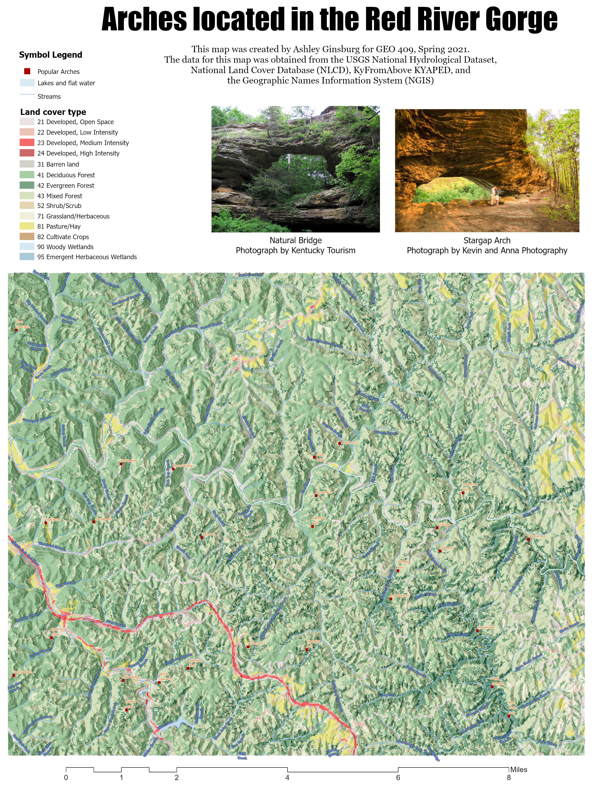

# rrg2
https://github.com/AshleyGinsburg/rrg2
## Popular arches of the Red River Gorge

https://AshleyGinsburg.github.io/rrg2

[Link to GeoPDF](basemap/rrg-arches.pdf)

## Images of arches 

*Natural Bridge*, photograph by Kentucky Tourism 

*Hidden Arch*, photograph by Red River Gorge website

*Stargap Arch*, photograph by Kevin and Anna Photography 

*Whistling Arch*

*Animation*
[Link to video](WhistlingArchAnimation.gif)

[link to site map](https://api.mapbox.com/styles/v1/ashley-ginsburg/cko9112zn16c517p7afqpg1gi.html?fresh=true&title=view&access_token=pk.eyJ1IjoiYXNobGV5LWdpbnNidXJnIiwiYSI6ImNrbmVvZDhyZzAwczIycHA1cTQ5ODJ1eTcifQ.KNkLfexJ4_dA3feOCni1aw)

[link to tour](https://cesium.com/ion/stories/viewer/?id=ca167632-c74f-4a1a-800d-042c7724ef3b)